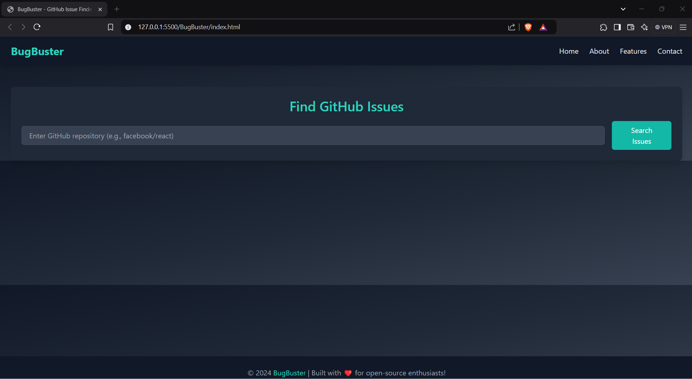
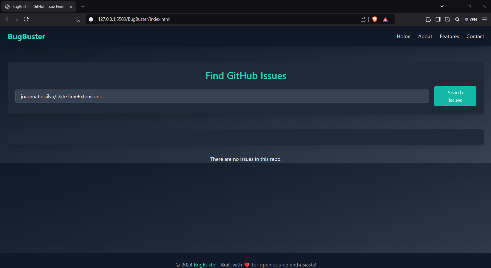

# GitHub Issue Tracker

A web application to fetch and display issues from a GitHub repository. Users can search for a repository to view its open issues and receive a clear message if no issues are found.

---

## 🚀 Features

- Search for GitHub repository issues by repository name.
- Fetches all issues and displays them in an organized layout.
- Displays issue details including title, description (if available), and creator.
- Clear messaging if no issues are found or in case of an error.
- Fully responsive design for desktop and mobile devices.

---

## 🛠️ Technologies Used

- **Frontend**: HTML, Tailwind CSS (inlined for this project)
- **JavaScript**: Fetch API for making requests to the GitHub API.

---

## 📸 Screenshots

### Main Interface


### Issues Display


---

## ⚙️ How to Run the Project

### 1. Clone the Repository
```bash
git clone https://github.com/<your-username>/<repo-name>.git
cd <repo-name>
```

### 2. Open in a Browser
Simply open the `index.html` file in your preferred web browser.

---

## 💡 Usage Instructions

1. Enter the repository name in the search bar (e.g., `owner/repository`).
2. Click the **Search** button.
3. The application will fetch and display issues from the specified repository.
4. If no issues are found, you'll see a message: *"There are no issues in this repo."*
5. If the repository name is invalid or an error occurs, you'll see an appropriate error message.

---

## 🧩 Project Structure

```plaintext
.
├── index.html         # Main HTML file
├── script.js          # JavaScript for functionality
├── README.md          # Documentation (you're reading it!)
├── homepage.png       # image of the homepage (how the UI looks)
├── working.png        # image of working (to showcase how the result looks like)

```

---

## 🌟 Features in Progress

- [ ] User authentication for private repositories.
- [ ] Filter issues by labels.
- [ ] Option to create and manage issues directly from the app.

---


## 🤝 Contributing

Contributions are welcome! Please follow these steps:
1. Fork this repository.
2. Create a branch: `git checkout -b feature-name`.
3. Commit your changes: `git commit -m 'Add feature-name'`.
4. Push to your branch: `git push origin feature-name`.
5. Submit a pull request.

---

## 🙋‍♂️ Support

If you encounter any issues or have questions, feel free to [open an issue](https://github.com/<your-username>/<repo-name>/issues).

---
